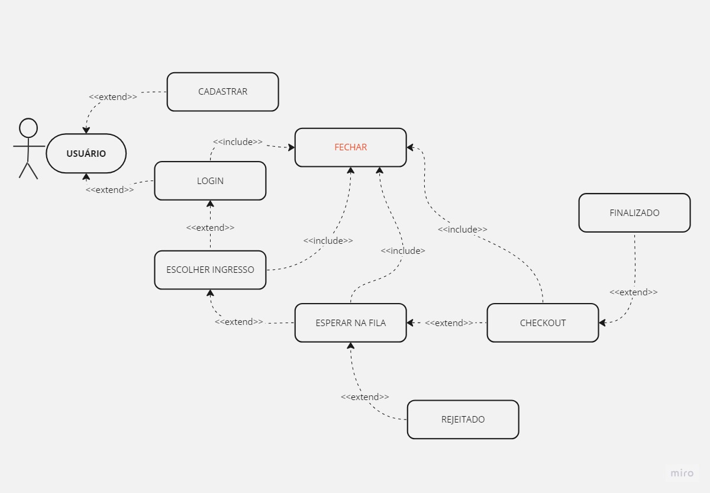

# Estrutura de software para compra de Ingressos

A imagem represnta um simples diagrama de caso de uso, que serve como um ínicio para outros diagramas, no qual molda os requisitos funcionais e indetifica o ator e funcionalidades do sistemas de compra de ingressos de grande demanda, com base na perspetiva do usuário. 

## Diagrama

